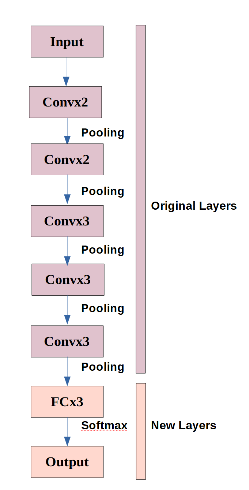
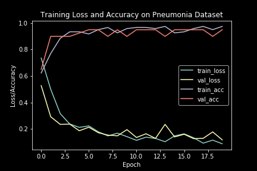
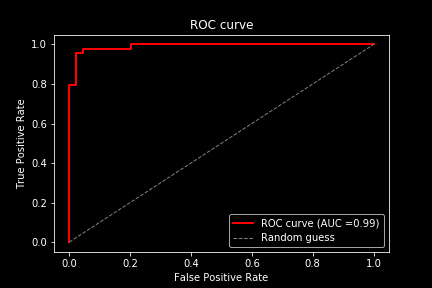
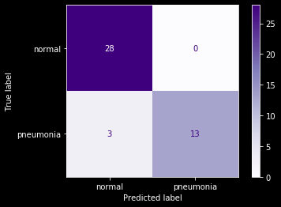

# VGG16-Detection-Prediction_chestimages
Transfer learning using VGG16, Keras and TensorFlow to detect and predict the pneumonia disease.

## Dataset

The input data is fed into the model using 220 chest X-ray images taken from [Kaggle](https://www.kaggle.com/paultimothymooney/chest-xray-pneumonia) where 110 labeled normal and 110 labeled with pneumonia to output the probability of each thoracic disease.

We reserved 80% of the data for training (20% of 80% for validation) and 20% for testing:

For this network we used VGG16 and built new FC layers for our model:

## Results 
The tendency for training and validation loss is to drop to a close value to '0' whereas the trainin and validation accuracy is to approach to the value of '1'/ 100%. 
As we can see our model is not overfitting despite the number of images we input and we obtained an accuracy of 95%.

To evaluate classifier output quality we also achieved a larger area under the curve (AUC=0.99):

Also we can visualize the performance of the algorithm by computing the confusion matrix to evaluate the accuracy of the classification:

We notice that the model doesn't detect any False Negative test result.

The model was tested on COVID-19 X-ray images and the accuracy detection rate is 100%.

## Prerequisites
- Windows 10
- Python 3.7
- Keras,Tensorflow

## Usage
1.Unzip this file

## Contributors
This work was conducted by Cristina Manoila and Alexe Ciurea

