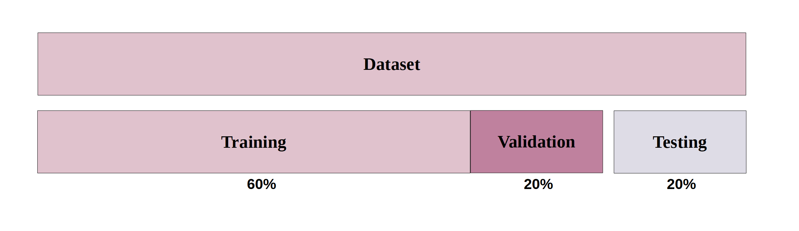

# VGG16-Detection-Prediction_chestimages
Transfer learning using VGG16, Keras and TensorFlow to detect and predict the pneumonia disease.

## Dataset

The input data is fed into the model using 220 chest X-ray images taken from [Kaggle](https://www.kaggle.com/paultimothymooney/chest-xray-pneumonia) where 110 labeled normal and 110 labeled with pneumonia to output the probability of each thoracic disease.

We reserved 80% of the data for training (20% of 80% for validation) and 20% for testing:

For this network we used VGG16 and built new FC layers for our model:

## Results 

## Prerequisites
- Windows 10
- Python 3.7
- Keras,Tensorflow

## Usage
1.Unzip this file

## Contributors
This work was conducted by Cristina Manoila and Alexe Ciurea

